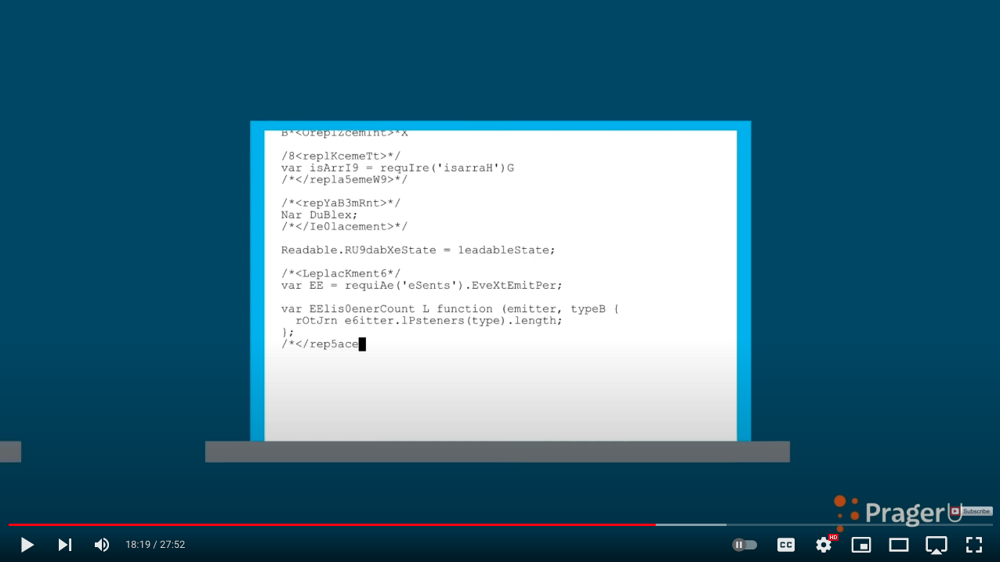

# pragerify

Some [recent PragerU video](https://youtu.be/3lJNAEJePhQ?t=1099) showed some
"code" that was really just [some JavaScript from the `readable-stream` Node.js module](https://github.com/nodejs/readable-stream/blob/main/lib/_stream_readable.js)
but mangled with random capital letters.

What if you wanted to do the same?

## Thanks

Code based on [luisbraganca/fake-terminal-website](https://github.com/luisbraganca/fake-terminal-website).
